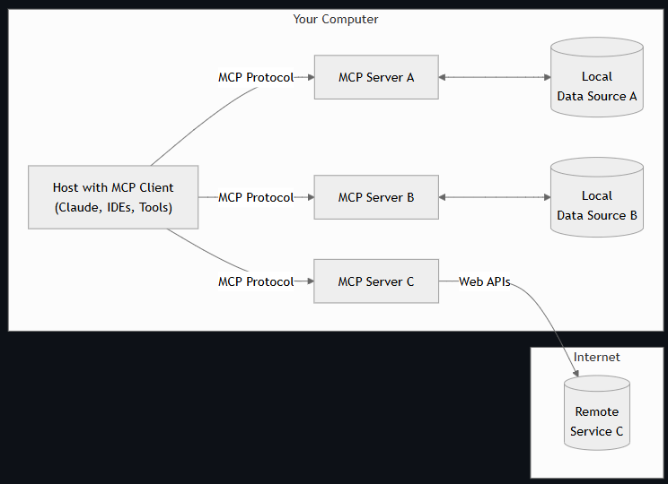

# <h1 align="center">MCP Crash Course for Python Developers</h1>

Senior Data Scientist.: Dr. Eddy Giusepe Chirinos Isidro

Este estudo foi baseado no tutorial de [Dave Ebbelaar]()

## `Parte 2:` Compreendendo o MCP em um nível técnico

### Visão geral da arquitetura do MCP

O Protocolo de Contexto do Modelo segue uma arquitetura `cliente-host-servidor`: essa separação de preocupações permite sistemas modulares e combináveis, onde cada servidor pode se concentrar em um domínio específico (como acesso a arquivos, pesquisa na web ou operações de banco de dados).

`Clientes MCP`: clientes de protocolo que mantêm conexões 1:1 com servidores

`Hosts MCP`: programas como Claude Desktop, IDEs ou seu aplicativo Python que desejam acessar dados por meio do MCP
* `Hosts MCP`: programas como Claude Desktop, IDEs ou seu aplicativo Python que desejam acessar dados por meio do MCP

* `Clientes MCP`: clientes de protocolo que mantêm conexões 1:1 com servidores

* `Servidores MCP`: programas leves que expõem recursos específicos por meio do `Protocolo de Contexto do Modelo` padronizado (Tools, recursos, prompts)

* `Fontes de dados locais`: arquivos, bancos de dados e serviços do seu computador que os servidores MCP podem acessar com segurança

* `Serviços remotos`: sistemas externos disponíveis pela Internet (por exemplo, por meio de APIs) aos quais os servidores MCP podem se conectar

Essa separação de preocupações permite sistemas modulares e combináveis, onde cada servidor pode se concentrar em um domínio específico (como acesso a arquivos, pesquisa na web ou operações de banco de dados).

O MCP define três primitivas principais que os servidores podem implementar:

``1.`` [Ferramentas - Tools](https://modelcontextprotocol.io/docs/concepts/tools#python): Funções controladas por modelo que os ``LLMs`` podem invocar (como chamadas de API, cálculos, etc.)

``2.`` [Recursos - Resources](https://modelcontextprotocol.io/docs/concepts/resources#python): Dados controlados pelo aplicativo que fornecem contexto (como conteúdo de arquivo, registros de banco de dados, etc.)

``3.`` [Prompts](https://modelcontextprotocol.io/docs/concepts/prompts#python): Templates controlados pelo usuário para interações ``LLM``

Para ``desenvolvedores Python``, o primitivo mais imediatamente útil são as ferramentas, que permitem que os ``LLMs`` executem ações programaticamente.

### Mecanismos de Transporte um Mergulho Profundo

O MCP suporta três mecanismos principais de transporte:

Stdio (E/S padrão) :

A comunicação ocorre por meio de fluxos de entrada/saída padrão
Melhor para integrações locais quando o servidor e o cliente estão na mesma máquina
Configuração simples sem necessidade de configuração de rede
SSE (Eventos enviados pelo servidor) :

Usa HTTP para comunicação cliente-servidor e SSE para comunicação servidor-cliente
Adequado para conexões remotas entre redes
Permite arquiteturas distribuídas
Entender quando usar cada transporte é crucial para criar implementações eficazes de MCP:

Use Stdio ao criar integrações de aplicativos individuais ou durante o desenvolvimento
Use o SSE quando precisar de acessibilidade remota ou estiver integrando com clientes que exigem isso
Comparação de Mecanismos de Transporte

Thank God!
