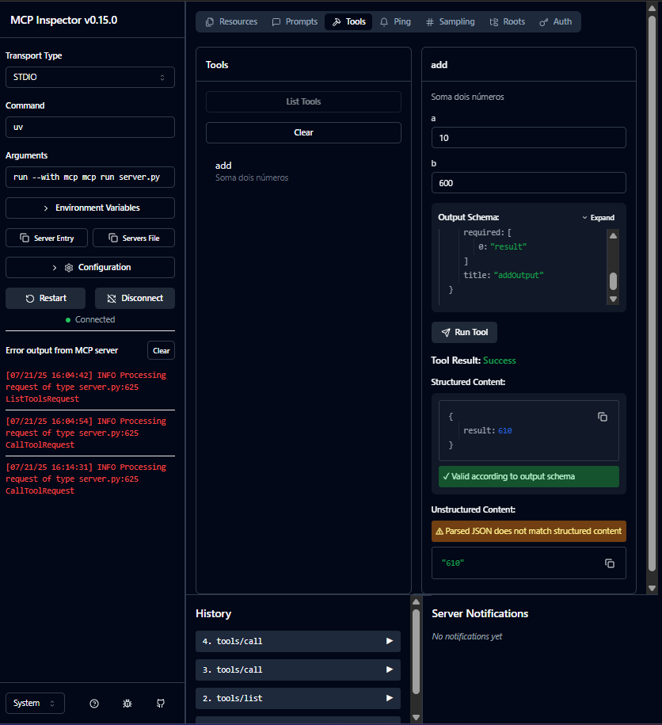

# <h1 align="center"><font color="gree">MCP Crash Course for Python Developers</font></h1>

<font color="pink">Senior Data Scientist.: Dr. Eddy Giusepe Chirinos Isidro</font>

Este estudo foi baseado no tutorial de [Dave Ebbelaar]()




## <font color="red">`Parte 3:` Configuração simples do servidor com o Python SDK</font>


### <font color="blue">Construindo nosso primeiro servidor MCP</font>

Vamos criar um servidor de demonstração simples com uma tool:

```python
# server.py
from mcp.server.fastmcp import FastMCP

# Criando um servidor MCP:
mcp = FastMCP("DemoServer")

# Ferramenta simples:
@mcp.tool()
def say_hello(name: str) -> str:
    """Diz oi para alguém

    Args:
        name: O nome da pessoa a ser cumprimentada
    """
    return f"Olá, {name}! É um prazer te conhecer."

# Executando o servidor:
if __name__ == "__main__":
    mcp.run()
```

### <font color="blue">Executando o servidor</font>
Existem várias maneiras de executar seu servidor MCP:

#### <font color="yellow">`1.` Modo de desenvolvimento com MCP Inspector</font>

A maneira mais fácil de testar seu servidor é usando o MCP Inspector:

```bash
mcp dev server.py
```
Isso executa seu servidor localmente e o conecta ao `MCP Inspector`, uma ferramenta web que permite interagir diretamente com as ferramentas e recursos do seu servidor. Isso é ótimo para testes.


#### <font color="yellow">`2.` Integração com o Claude Desktop</font>
Se você tiver o `Claude Desktop` instalado, poderá instalar seu servidor para usar com o `Claude`:

```bash
mcp install server.py
```
Isso adicionará seu servidor à configuração do `Claude Desktop`, tornando-o disponível para Claude.


#### <font color="yellow">`3.` Execução Direta (somente necessária ou SSE)</font>
Você também pode executar o servidor diretamente:

```bash
# Método 1: Executando como um script Python
python server.py

# Método 2: Usando UV (recomendado)
uv run server.py
```

### <font color="blue">O que acontece quando você executa um servidor MCP?</font>


